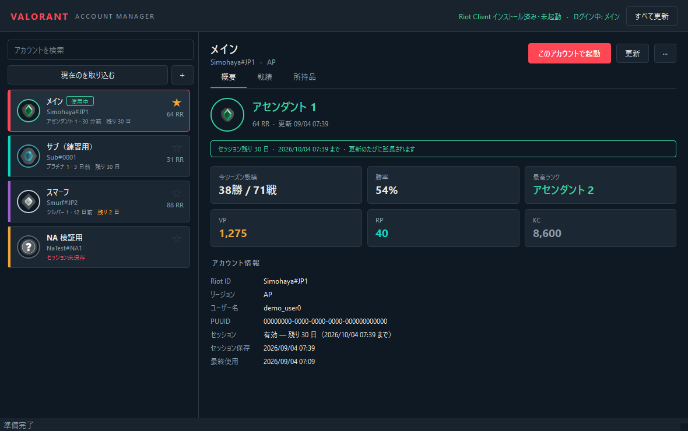

# VALORANT Account Manager

複数の VALORANT アカウントを、パスワードを打ち直さずに切り替えるための Windows デスクトップアプリ。
ランク・ウォレット・所持スキンも、アカウントを切り替えずにまとめて確認できる。



## できること

| 機能 | 説明 |
|---|---|
| アカウント切り替え | ログイン済みセッションを保存しておき、ワンクリックで差し替えて VALORANT を起動 |
| 自動ログイン | セッションが失効したときのフォールバック。ID→Tab→パスワード→サインインまでキーボードだけで行う |
| ランク管理 | 現在ランク・RR・勝率・最高ランクを全アカウント分まとめて取得 |
| 戦績 | 直近のコンペティティブ戦のランク変動履歴 |
| 所持品 | 所持スキンをレア度別に集計、エージェント／カード／タイトル等の所持数 |
| ウォレット | VP / RP / KC の残高 |
| 認証情報の保管 | ID・パスワードを暗号化して保存。右クリックからコピー |
| セッションの延長 | 再認証のたびに cookie を書き戻して有効期限を更新。残り日数を常時表示 |

## セキュリティ

- アカウント情報は **AES-256-GCM** で暗号化して 1 ファイルに保存する
- その鍵は **Windows DPAPI (CurrentUser)** で包む。**このWindowsユーザーでログインしている状態でしか復号できない**
- 任意で **マスターパスワード**（PBKDF2-HMAC-SHA256 / 60万回）を追加できる。設定すると、同じ Windows ユーザーでもパスワード無しでは開けない
- Riot のセッション cookie も同じ鍵で暗号化して保管する
- パスワードは平文ではどこにも書き出さない。ネットワークにも送らない

> マスターパスワードを忘れると保管庫は開けません。復旧手段はありません。

## 動作要件

- Windows 10 / 11
- VALORANT（Riot Client）がインストールされていること

## 導入

### exe を使う（Python 不要）

[Releases](../../releases) から `ValorantAccountManager.exe` を落として実行するだけ。
インストール不要。設定と保管庫は `%LOCALAPPDATA%\ValorantAccountManager` に作られる。

### ソースから動かす

Python 3.11 以上が必要。

```bash
pip install -r requirements.txt
python main.py
```

`run.cmd` をダブルクリックでも起動できる。

### 最初の登録

1. Riot Client で普通にログインする（**「ログイン情報を保存する」を必ず有効にする**）
2. 本アプリで **「現在のを取り込む」** を押す
3. 登録したいアカウントの分だけ、ログインし直して 1〜2 を繰り返す

セッションを保存できていれば、以降はパスワード不要で切り替えられる。

### 切り替え

アカウントをダブルクリック、または **「このアカウントで起動」**。内部では次の順で動く。

1. 現在ログイン中のアカウントが登録済みなら、そのセッションを退避
2. Riot Client と VALORANT を終了（Vanguard には触らない）
3. 対象アカウントのセッションファイルを書き戻す
4. `RiotClientServices.exe --launch-product=valorant --launch-patchline=live` で起動

セッションが失効していて、かつ ID/パスワードが登録済みなら、自動入力にフォールバックする。

### 自動入力の中身

ユーザー名 → Tab → パスワード → 「サインイン状態を維持」 → Enter。
**すべてキーボードで行い、座標クリックには頼らない。**

実機 (Riot Client v138.0.1) で確かめた要点:

- UI は **Electron**。ウィンドウクラスは `Chrome_WidgetWin_1`、プロセス名は `Riot Client.exe`
- `Chrome_WidgetWin_1` は Chromium 系アプリの汎用クラスなので、**クラスだけで判定してはいけない**。
  所有プロセスが Riot のものかで絞っている
- **`SetForegroundWindow` を呼ぶだけでは「最前面に出るがアクティブでない」状態になることがある。**
  そうなると Riot Client は画面を暗転させたままで、キー入力が 1 文字も届かない。
  ALT の空打ちと `AttachThreadInput` で確実に活性化してから打つ
- 正しくアクティブ化できていれば、起動直後のログイン画面はユーザー名欄に
  フォーカスが載っているので、クリックは要らない
- 起動直後はスプラッシュ (600x600) が出て、読み込み後にウィンドウが作り直される。
  古いハンドルは無効になるので、大きさが安定するまで取り直して待つ
- 「サインイン状態を維持」へは Tab 7 回。位置を決め打ちせず、
  **フォーカスリングを見て到達を判定**してから Space で入れる

> **「サインイン状態を維持」は自動で有効にする。** これが無いと
> `riot-login: persist: null` のままセッションが保存されず、切り替えに使えない。
> 既に有効なら触らない。状態を判別できないときも触らない (誤って外さないため)。

ログイン画面は hCaptcha で保護されている。captcha や 2 段階認証が出た場合は
アプリ側では何もできないので、画面に従って対応すること。

### ショートカット

| キー | 動作 |
|---|---|
| `Ctrl+N` | アカウントを追加 |
| `Ctrl+R` | 選択中を更新 |
| `Ctrl+Shift+R` | すべて更新 |
| `F5` | 一覧を再読み込み |

## デモモード

VALORANT が入っていない PC でも、モック環境で UI と切り替えロジックを試せる。

```bash
python main.py --demo
```

偽の Riot ディレクトリ・偽のセッション YAML・偽のローカル API サーバーを立てて、
サンプルアカウント 4 件を入れた使い捨ての保管庫で起動する。実環境には一切触らない。

## 構成

```
main.py                  エントリポイント
vam/
  paths.py               Riot Client / VALORANT の場所を探す
  crypto.py              DPAPI + AES-GCM
  storage.py             暗号化された保管庫
  models.py              Account / RankInfo / WalletInfo / InventoryInfo
  service.py             中核。UI からはここだけを呼ぶ
  diagnostics.py         クラッシュログと環境情報
  riot/
    process.py           Riot 系プロセスの終了
    session.py           セッションファイルの保存・復元・解析
    launcher.py          Riot Client の起動
    localapi.py          起動中クライアントのローカル API (lockfile 経由)
    auth.py              保存 cookie からのトークン再取得 (RSO reauth)
    api.py               pd.*.a.pvp.net (ランク・ウォレット・所持品)
    content.py           valorant-api.com (名前・アイコン)
    autologin.py         パスワード自動入力 (SendInput)
  ui/                    PySide6 の画面
  mock/                  偽 Riot 環境とデモデータ
tests/test_all.py        通しテスト (VALORANT 未インストールでも全部走る)
tools/ui_shot.py         UI のスクリーンショット撮影
tools/build_exe.py       配布用 exe のビルド
```

## テスト

```bash
python tests/test_all.py
```

VALORANT が入っていなくても全項目が走る。`vam/mock/fake_riot.py` が本物と同じ
ディレクトリ構造・同じ YAML 形状・同じローカル API（自己署名 HTTPS + lockfile Basic 認証）
を用意するため、切り替えロジックは実環境と同じ経路を通る。

## セッションの有効期限

切り替えに使う Riot のセッション cookie (`ssid`) には有効期限がある。本アプリは
**再認証のたびに、Riot が返してくる新しい cookie を保管庫に書き戻す**ので、
使い続けているアカウントの期限は自動的に伸びていく。

期限が更新されるタイミング:

- 「更新」／「すべて更新」（ランク取得のたびに再認証が走る）
- 「戦績」タブの読み込み
- 右クリック →「セッションを延長」（延長だけを明示的に行う。切り替えは起きない）

残り日数は次の 3 か所に出る。

- アカウントカードの状態行（残り 7 日を切ると橙色、失効・未保存は赤）
- 概要タブ上部の帯（期限日時つき）
- 概要タブの「セッション」行と、カードのツールチップ

長く放置して期限が切れたアカウントは、Riot Client でそのアカウントにログインし直し、
右クリック →「現在のログインをこのアカウントに保存」で取り込み直す。

> 書き戻しは、読み直して**有効かつ期限が延びていること**を確認してからでないと行わない。
> 壊れた応答や期限の縮む応答で、使えているセッションを潰さないようにしてある。

## うまくいかないとき

ヘッダ右の **「?」ボタン** で診断情報が出る。Riot Client の検出結果、セッションファイルの
有無、起動中プロセスなどが並ぶので、そのままコピーして報告に使える。

予期しないエラーで落ちた場合は `%LOCALAPPDATA%\ValorantAccountManager\crash.log` に
スタックトレースが残る。

よくある詰まりどころ:

| 症状 | 原因と対処 |
|---|---|
| 「Riot Client が見つかりません」 | VALORANT 未インストール、または非標準の場所。診断情報で検出パスを確認 |
| 「ログイン中のアカウントが見つかりません」 | Riot Client のログイン時に「ログイン情報を保存する」が無効。有効にして入り直す |
| 取り込めるが「更新」が失敗する | cookie 再認証が通っていない。診断情報とエラー文言を添えて報告 |
| 切り替え後にログイン画面が出る | セッションが失効している。そのアカウントで入り直して取り込み直す |

## セッションファイルの形

切り替えの土台になるファイルなので、実機 (Riot Client 134.x) で確認した形を残しておく。
`%LOCALAPPDATA%\Riot Games\Riot Client\Data\RiotGamesPrivateSettings.yaml`

```yaml
psl:
    authorization:
        riot-client: null
riot-login:
    persist: null            # ログイン情報を保存していないと null
rso-authenticator:
    ssid:                    # 名前付きマッピング。リストではない
        domain: "riotgames.com"
        expiryTime: 1820012619   # cookie の寿命はここ
        hostOnly: false
        httpOnly: true
        name: "ssid"         # 名前も値も引用符付き
        path: "/"
        persistent: true
        secureOnly: true
        value: "eyJhbGciOi..."
    tdid:
        ...
```

引っかかりやすい点:

- **cookie 名も値も引用符で囲まれる。** 素朴に `name:\s*(\w+)` で拾うと 1 件も取れない
- **寿命は JWT の `exp` ではなく `expiryTime`。** `tdid` の JWT はクレームが
  `iat` / `id` / `nonce` だけで、`exp` も `sub` も持たない
- **`ssid` が無ければ未ログイン。** そこにある別の JWT を代用してはいけない
- 読み取りは PyYAML、書き戻しは行単位の差し替え。YAML を書き直すと引用符や
  並び順が変わり、Riot Client 側が読めなくなる危険がある

## 注意

- **アカウント切り替えは Riot Client を終了させる。** ゲーム中に実行すると確認を求められる
- Riot Vanguard（カーネルドライバ）には触らない。停止すると再起動が必要になるため
- 自動入力は Riot Client の画面構成 (入力欄の位置) に依存する。Riot 側の変更で壊れうるので、通常はセッション方式を使う
- ログイン画面は hCaptcha で保護されている。本アプリは captcha に一切触れないし、サインインも押さない
- **cookie のローテーション挙動は実アカウントでは未検証**（開発機に VALORANT が入っていないため）。
  Riot が cookie を更新しない場合は延長されず、その旨がダイアログに出る
- 取得するのは自分のアカウントの情報のみ。他プレイヤーの情報を覗く機能は入れていない
